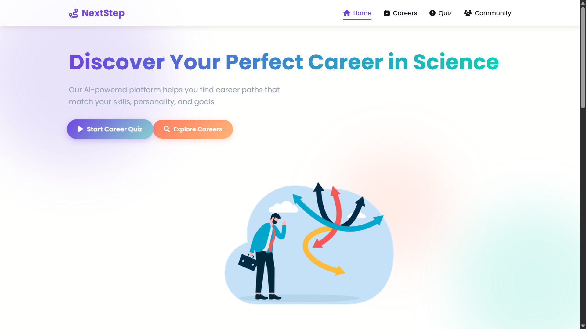

# 🚀 NextStep – Your Career Launchpad

**NextStep** is a multi-page, responsive landing website built to help students and young professionals explore, choose, and prepare for the right career path.

> 👨‍💻 Internship Task 2 – CodSoft Web Development Internship  
> 🧑‍🎓 Submitted by: Ankit Kumar  
> 🧰 Tech Stack: HTML, CSS, JavaScript

---

## 🌟 Features

- 🎯 **Landing Page** with animated background and call-to-action
- 💼 **Careers Page** showing different paths like Tech, UPSC, MBA, etc.
- ❓ **Quiz Page** that helps users decide which path suits them
- 🌍 **Community Page** with sample discussions and mentor showcase
- 📱 Fully responsive layout for all screen sizes
- 🎨 Premium modern UI with floating button, glassmorphism, gradients
- 📊 Career visualization section and toggleable resources
- 🎉 Confetti effect on quiz completion

---

## 📁 Pages Included

| File            | Description                          |
|-----------------|--------------------------------------|
| `index.html`    | Hero section + CTA + features        |
| `careers.html`  | Grid of career options + resources   |
| `quiz.html`     | Career quiz with interactive UI      |
| `community.html`| Student discussions + mentor cards   |

---

## 📸 Preview

---

## 📚 Folder Structure

📁 NextStep/
├── index.html
├── careers.html
├── quiz.html
├── community.html
├── style.css
└── script.js

---

## 🛠 How to Run

1. Download or clone the repository
2. Open `index.html` in your browser
3. Navigate through links (no server required)

---

## 👨‍💻 Author

- **Ankit Kumar**
- 📧 ankitkr8651005671@gmail.com
- 🌐 [GitHub Profile](https://github.com/Ankit-Kumar8651)

---

## 📝 License

This project is open for learning and internship submission purposes only.

---

