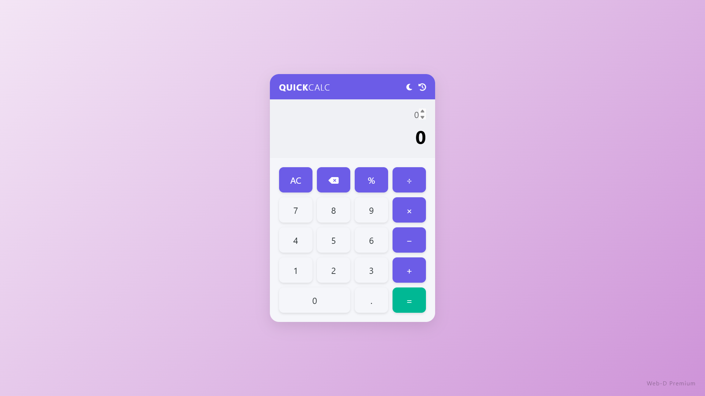

# 🔢 QuickCalc Pro – Premium JavaScript Calculator

> **CodSoft Web Development Internship – Task 3**  
> **Intern:** Ankit Saini  
> **Task:** Build an Interactive Calculator  
> **Tech Stack:** HTML, CSS, JavaScript  

---

## 🌟 Features

- 🧮 Basic operations: Addition, Subtraction, Multiplication, Division, Percentage
- 💡 Smart keyboard input support
- 🕶️ Dark/Light mode toggle
- 🕰️ Calculation history with memory and auto recall
- 🖱️ Interactive button design with hover and active animations
- 📱 Fully responsive layout for mobile and desktop
- 🧠 Auto-scroll for long calculations
- ✨ Clean UI with glassmorphism and branding

---

## 🖼️ Preview

---

## 🗂️ Project Structure

        QuickCalc-Pro/
        ├── index.html
        ├── style.css
        ├── script.js
        └── screenshot.png

---

## 🚀 How to Use

1. Clone or download this repository
2. Open `index.html` in your browser
3. Click buttons or use keyboard to calculate
4. Use `moon/sun` icon to toggle dark mode
5. Click `history` icon to view or restore past calculations

---

## 🧠 Keyboard Shortcuts

| Key        | Action                |
|------------|------------------------|
| 0–9, +, -, *, / | Enter values and operators |
| `Enter`    | Calculate (=)         |
| `Backspace`| Delete one character  |
| `Escape`   | Clear all (AC)        |
| `H`        | Toggle history panel  |

---

## 🧑‍💻 Developer Info

**Ankit Kumar**  
[LinkedIn Profile](https://www.linkedin.com/in/ankit-saini-106585329)  
🔗 GitHub: [@Ankit-Kumar8651](https://github.com/Ankit-Kumar8651)

---

## 📃 License

This project is built for educational purposes under the CodSoft Internship and is free to use and improve.

---

